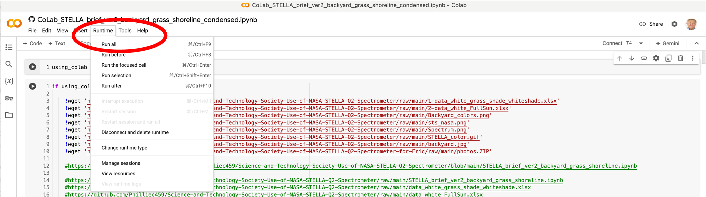

# **NASA STELLA VIDEO ON THEIR STELLA SPECTROMETERS:**

[Video](https://youtu.be/QSF4F-YlcH4?si=3oZV0hKy_0xDA0NJ)

# **NASA STELLA APPLICATIONS VIDEO:**

[Video](https://youtu.be/LcWqBePYx40?si=j_ZxgUGYjMyRDMdf)

# **STELLA, Landsat and PACE Ocean Data Jupyter Notebooks:**
We have 4 CoLab-ready Jupyter Notebooks in GitHub to process NASA STELLA, Landsat and PACE Ocean data. Just click on the hyperlinks below for each notebook example. 

**STS EXAMPLE 1:** STELLA DATA SIMPLE APPLICATION:

[CoLab_STELLA_brief_ver2_backyard_grass_shoreline_condensed.ipynb](https://github.com/Philliec459/Science-and-Technology-Society-Use-of-NASA-STELLA-Q2-Spectrometer-for-Eric/blob/main/CoLab_STELLA_brief_ver2_backyard_grass_shoreline_condensed.ipynb)

**STS EXAMPLE 2:** PROCESS NASA LANDSAT DATA:

[CoLab_VegIndex4_training_RobinsonPreserve_simple_Level2.ipynb](https://github.com/Philliec459/Science-and-Technology-Society-Use-of-NASA-Landsat-Data-to-Calculate-NDVI-and-PNDVI/blob/main/CoLab_VegIndex4_training_RobinsonPreserve_simple_Level2.ipynb)

**STS EXAMPLE 3:** PROCESS NASA PACE HYPERSPECTRAL OCEAN DATA:
This takes a while to load all HyperCoast[extra] python libraries and PACE dataset.  It takes ~5 minutes to run entire project to our ÔbreakÕ point that stops the code. Beyond the break point are experimental Red Tide (Karenia brevis) indicators that have not been tested. 

[CoLab_ netCDF4_PACE.ipynb](https://github.com/Philliec459/STS-Software-to-Download-and-Process-NASA-PACE-Ocean-Ecosystem-hyperspectral-data/blob/main/CoLab_%20netCDF4_PACE.ipynb)

**STS COMPREHENSIVE STELLA EXAMPLE 4:**  PROCESS AND PREDICT VEGETATIVE SPECIES FROM HOME DEPOT STELLA DATA:
This too takes a while to load python libraries and data. It takes ~2 minutes to run. Check out the interactive Altair displays at the end where you can select samples from the plot to view the plant species photos for each reading. 

[CoLab_STELLA_brief_ver2_brief_to_Ed_Chiles_ver2.ipynb](https://github.com/Philliec459/STS-STELLA-Spectrometer-Readings-on-Various-Plant-Species-with-NDVI/blob/main/CoLab_STELLA_brief_ver2_brief_to_Ed_Chiles_ver2.ipynb)

## **ADDITIONAL RESOURCES:**
**EARTH EXPLORER:** If you need to setup an Earth Explorer account to download PACE or Landsat data, then please click on the following link:

[Earth Explorer login](https://ers.cr.usgs.gov/login?RET_ADDR=https%3A%2F%2Fearthexplorer.usgs.gov%2F)

**GOOGLE ACCOUNT:** You will need to log into your Google Account to login. If you do not have one, then go to this link below: 

[Google Account](https://support.google.com/accounts/answer/27441?hl=en)

We have not tested this link and are not aware of any costs for the basic account.

## **HOW TO RUN IN COLAB:**
1) If you click on the Jupyter Notebook links that we have provided, you will see the following type of image while you are still in GitHub. Click on the banner **"Open in CoLab"** at the top, and this will open this notebook in Google CoLab. Look to the far upper right corner of the web page to make sure that you are logged into your google account. If not, then login before trying to run CoLab. 

2) On the top title bar of CoLab there is a label called **"Runtime"**(second image below). Click on this and then click on **"Run all"**. That is it. The notebook will get all of the data files and run python. It could take a few minutes, but I have tested this in my environment, and it works fine.

3) When finished, then I would suggest in the **"Runtime"** column, click on **"Disconnect and delete runtime"** to end your CoLab session. 

